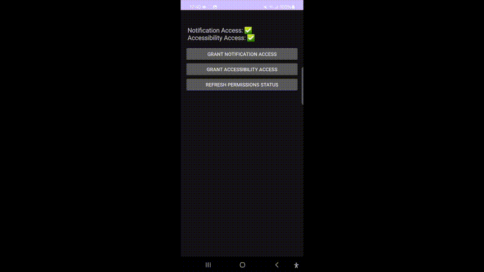

# TicketBuyerBot 🕵️🎟️

TicketBuyerBot is a lightweight Android automation tool built to automatically react to ticket availability notifications from the TicketSwap app. Its goal is to minimize delay between ticket drop alerts and user actions like opening the app and tapping "Add to cart".

## 🚀 Features

- 📬 Listens for push notifications from the TicketSwap app
- 🚀 Automatically opens the app when relevant notifications arrive
- 👀 Uses AccessibilityService to find and click the "Add to cart" button
- 💤 Keeps the screen awake to ensure the device doesn't sleep during critical periods

## 🛠 How It Works

1. **NotificationListenerService** catches notifications from TicketSwap.
2. **PendingIntent** from the notification is used to open the TicketSwap app.
3. **AccessibilityService** waits for the ticket listing screen and clicks the appropriate purchase button.

## ⚙️ Setup Instructions

1. Clone this repo.
2. Open in Android Studio.
3. Grant required permissions:
   - Notification access
   - Accessibility access
4. Install the app on your device/emulator.
5. Optionally, customize supported strings in different languages in the source code.

## 🔐 Permissions

This app requires the following permissions to function:
- `BIND_NOTIFICATION_LISTENER_SERVICE`
- `BIND_ACCESSIBILITY_SERVICE`

These are granted manually by the user in system settings.

## 🤖 Intended Use

This project is intended for **educational and personal use**. It demonstrates how Android's accessibility and notification systems can be used to automate workflows for UI-driven apps.

⚠️ **Note:** Automating commercial apps may violate their terms of service. Use responsibly.

## 📄 License

MIT License. See [LICENSE](LICENSE) for details.

